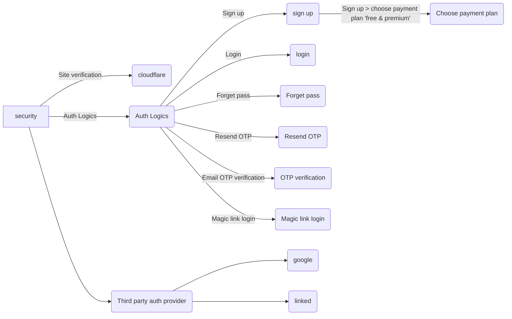

# Website ( feedback.com ) 🌐

*   home

*   feature

*   pricing

*   template `i can see sample demo campaign`

*   about

*   contact `( form entry) with cloud flare verification`

     

# security 🔒

*   site verification [cloudflare](https://cloudflare.com/)

**Auth Logic:**

*   sign up

*   login

*   forget pass

*   resend OTP

*   OTP verification `( email otp )`

*   magic link `login`

> sign up 👀 > he can choose a payment plan also ( free & premium )

**Third-party authentication provider:**

*   google

*   linked-in

 

<!--MERMAID {width:100}-->

<!--MCONTENT {content: "graph LR \nA\\[security\\] \\-\\-\\>|Site verification| B(cloudflare) \nA \\-\\-\\>|Auth Logics| C(Auth Logics) \nC \\-\\-\\>|Sign up| D(sign up) \nC \\-\\-\\>|Login| E(login) \nC \\-\\-\\>|Forget pass| F(Forget pass) \nC \\-\\-\\>|Resend OTP| G(Resend OTP) \nC \\-\\-\\>|Email OTP verification | H(OTP verification) \nC \\-\\-\\>|Magic link login| I(Magic link login) \nD \\-\\-\\>|Sign up > choose payment plan 'free & premium'| J(Choose payment plan) \nA \\-\\-\\>| | K(Third party auth provider) \nK \\-\\-\\>| | L(google) \nK \\-\\-\\>| | M(linked) "} --->

 

# Feedback App 🖥️

 

## Dashboard Page

*   total feedback

*   today feedback

*   total campaign

*   current active campaign

*   top 5 campaign
 

feedback analyze counts chart:

 

 

## Account Page

*   profile view & edit

*   connect google `( auth option )`

*   password change option

*   2fa option

## Plans Page

*   free plan ( 1 campaign only )

*   premium plan ( unlimited campaign )

*   business plan ⚠️ ( holding )

 

|Plan|Campaign Limit |
|----|---------------|
|Free|1 campaign only|

 

 

## Third party integrations

 

This file was generated by Swimm. [Click here to view it in the app](https://app.swimm.io/repos/Z2l0aHViJTNBJTNBZmVlZGJhY2stZGlhZ3JhbXMlM0ElM0FqYWNrc29ua2FzaTE=/docs/qk3xzcz1).
